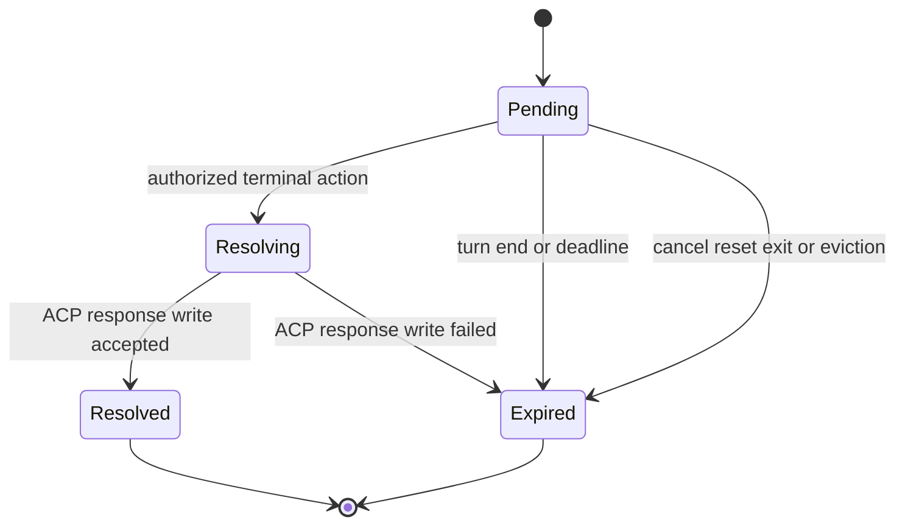

# Discord ACP Form Elicitation

## Context

OpenAB initializes each Agent Runtime with `clientCapabilities: {}`. Its downstream ACP reader has one special Agent-to-Client request path: it automatically answers `session/request_permission`. Other ID-bearing messages are treated as possible responses before their `method` is considered. An Agent Runtime therefore cannot use the official ACP v1 `elicitation/create` method to pause a turn and ask Discord users for structured information. A reverse request can also collide with an OpenAB request ID and remove the wrong pending response.

The requested outcome is official ACP v1 form elicitation for the Discord Native Adapter. OpenAB must advertise form support only when the session has a Discord presenter, show the requesting Agent Runtime and its form to the verified users who contributed to the active turn, return one `accept`, `decline`, or `cancel` result, and make every old control or text reply harmless after the request ends.

This Plan targets direct ACP `elicitation/create` only. The non-standard `session/request_input` bridge in the separately built `openab-agent` is not an alias and is not migrated by this change. URL elicitation is also not advertised.

## Objective

Add a platform-neutral form-elicitation module and a Discord presentation implementation that:

- sends `clientCapabilities.elicitation.form: {}` during `initialize` for Discord-backed sessions and leaves the capability absent for Slack, gateway, and other sessions;
- accepts official ACP v1 session-scoped and request-scoped `elicitation/create` form requests, including numeric or string JSON-RPC request IDs, and validates the supported flat schema before display;
- renders the complete ACP v1 form subset as a progressive Discord flow with defaults, field validation, review/modification, Submit, Decline, and Cancel;
- uses a reply-to-message text flow when a field cannot be represented safely by Discord controls or a component presentation fails;
- authorizes only verified human senders from the exact active dispatch batch;
- resolves each request once and invalidates it when its parent turn ends, reaches its configured hard deadline, is cancelled/reset, loses its process, or is evicted;
- bounds Agent-controlled work to one pending elicitation per connection, a 64 KiB serialized elicitation request, 50 fields, and 100 choices per field; and
- proves the real stdio exchange and overload refusal with a deterministic fake Agent Runtime run by the default workspace test command.

## Approach

Keep ACP request ownership in the ACP client layer, not in `Dispatcher` or Discord event code. Add an `ElicitationCoordinator` that owns schema parsing, active-turn authority, request leases, validation, and the one-terminal-result invariant. Give it a narrow presentation port that varies by platform. Discord implements that port; adapters without an implementation do not advertise the capability.

```text
Discord admitted messages
  → Dispatcher drains one batch and snapshots its verified human IDs
  → SessionPool selects the Discord form presenter before initialize
  → AcpConnection advertises clientCapabilities.elicitation.form
  → session/prompt installs the batch authority under the connection lock
  ← Agent Runtime sends elicitation/create
  → ACP reader classifies method+id as a request before response matching
  → ElicitationCoordinator validates scope/schema and opens a lease
  → Discord progressive form or reply-to-text fallback
  ← authorized interaction/text reply
  → coordinator atomically claims accept/decline/cancel
  → exact JSON-RPC response is written through the existing stdin writer
  → Discord prompt is marked resolved and all controls are disabled
```

Use a per-connection generation and a random opaque prompt nonce. Discord `custom_id` values carry only the nonce and action, not the ACP request, user IDs, schema, or response data. The coordinator remains the source of truth; editing the Discord message is best-effort projection cleanup. Admit at most one pending form per connection. Reject a second concurrent form with a bounded-time `-32000` “elicitation already pending” error, and reject a form over 64 KiB, 50 properties, or 100 choices in any property with `-32602`. Bound the underlying newline-delimited ACP reader to 1 MiB, so the size check does not first allocate an unlimited line.

The pending lifecycle is:



A progressive form presents one field at a time. Use a select for a supported single- or multi-select value, buttons for a boolean, and an “Enter value” button plus modal for free text and numeric values. Apply declared defaults. After all required fields are valid, show a review page with controls to revisit fields before Submit. Keep Decline and Cancel distinct and available throughout. If an enum exceeds Discord’s safe select limits, a modal/control shape is unavailable, or component creation fails, show type-specific text instructions and accept only an authorized reply to the active elicitation message. Never silently truncate fields or options.

The option set aside is a single compact modal. It is smaller, but it cannot safely represent an arbitrary flat ACP form, Discord limits modal layouts, and it does not provide a reliable review/modify step for all supported field types.

## Expected Change Surface

The boundaries this change is expected to touch. This list is guidance, not an allowlist: verify the real footprint during implementation and change whatever the Implementation Steps need, including files not named here. Stop and report only when discovery changes approved intent — the change reaches another subsystem, public behavior or architecture shifts, migration or compatibility risk grows, or the Verification Plan no longer proves the objective.

- `crates/openab-core/src/acp/elicitation.rs` — new platform-neutral module for ACP v1 form types, schema validation, turn/request scope checks, presentation contracts, authority snapshots, leases, and atomic terminal resolution.
- `crates/openab-core/src/acp/mod.rs` — exports the elicitation module and only the interfaces needed by adapters and tests.
- `crates/openab-core/src/acp/protocol.rs` — preserves inbound request IDs needed for bidirectional JSON-RPC and supplies exact success/error response envelopes; existing notification classification stays unchanged.
- `crates/openab-core/src/acp/connection.rs` — advertises caller-selected Client capabilities, classifies Agent-to-Client requests before outbound-response correlation, dispatches `elicitation/create` without blocking notification/liveness processing, and invalidates the connection generation on EOF/drop.
- `crates/openab-core/src/acp/pool.rs` — carries adapter form support into connection initialization and invalidates the exact connection’s leases on cancel, reset, replacement, idle/hung eviction, and shutdown without waiting for the connection mutex.
- `crates/openab-core/src/adapter.rs` — adds the optional form-presentation capability to the `ChatAdapter` interface and carries an active-turn authority snapshot into `stream_prompt_blocks`; default adapter behavior remains no elicitation support.
- `crates/openab-core/src/dispatch.rs` — keeps typed, already-admitted sender identity on `BufferedMessage`, derives the unique non-bot human authority set from the drained batch, and installs it only for the turn that acquires the shared session connection.
- `crates/openab-core/src/discord.rs` — implements progressive form rendering, modal/select/button and reply-to-text event handling, user/channel/message/nonce/generation checks, no-mention rendering, and resolved/expired message cleanup.
- `src/main.rs` — constructs one shared Discord adapter/presenter instance for the EventHandler, cron, and control paths instead of separate lazy and prebuilt adapter instances.
- `crates/openab-core/tests/acp_form_elicitation.rs` and its test fixture support — run the real `AcpConnection` against a deterministic bidirectional fake Agent Runtime and a recording presenter under default features.
- `docs/discord.md` — documents form behavior, authorization, text replies, expiry, supported ACP form types, and the prohibition on using form mode for secrets.
- `docs/canary-tests.md` — records the deterministic black-box command and a real Discord verification flow for reverse ACP requests.
- `docs/domain-language.md` — adds **Elicitation** and **Form Elicitation** as implemented ACP interaction terms and distinguishes them from tool permission requests and Discord modals.
- `README.md` — may add the Discord form capability to the concise feature list if the implementation makes the existing ACP feature summary materially incomplete.

The vendored upstream ACP server schema and generated types in `crates/openab-gateway/` are deliberately excluded. They describe OpenAB acting as an Agent for WebSocket clients; this change concerns OpenAB acting as the Client of a downstream Agent Runtime. `openab-agent/` and its legacy `session/request_input` extension are also excluded by the selected wire scope.

## Reuse Opportunities

- `crates/openab-core/src/acp/connection.rs::run_reader_loop` and the shared stdin `Arc<Mutex<ChildStdin>>` — retain one serialized write path and extend request classification without reacquiring the turn-held `AcpConnection` mutex.
- `crates/openab-core/src/acp/connection.rs::SessionActivity` and `AdapterRouter`’s existing prompt hard deadline — use the parent turn as the only elicitation deadline instead of adding a second timeout setting.
- `crates/openab-core/src/acp/pool.rs` cancel handles, exact-handle eviction checks, and synchronous facade-token revocation pattern — apply the same generation-safe invalidation discipline to elicitation leases.
- `crates/openab-core/src/discord.rs::truncate_for_discord`, config select builders, and `Interaction::Component` handling — reuse established Serenity builders and Discord’s 25-option discipline, but do not reuse predictable config IDs as authorization.
- `crates/openab-core/src/trust.rs` and Discord’s admitted `SenderContext.sender_id` — authority comes from identities that already passed the Trust Gate; do not re-derive it from component payloads or the global allowlist.
- `crates/openab-core/src/dispatch.rs::MockChatAdapter` and `crates/openab-core/src/acp/connection.rs` duplex reader tests — preserve current mock conventions for focused state tests while adding a real subprocess boundary for the black-box test.
- `docs/canary-tests.md` — follow its bidirectional stdio rules: newline-delimited JSON, separate stderr, bounded waits, exact ID correlation, and prompt completion only on the matching response.

## Implementation Steps

1. `crates/openab-core/src/acp/elicitation.rs` defines the ACP v1 form contract used by OpenAB: exactly one of `sessionId` or `requestId`, optional `toolCallId` only with `sessionId`, explicit `mode: "form"`, a flat object schema, and property values for string, number, integer, boolean, single-select string, and string-array multi-select. Titles, descriptions, required fields, defaults, `minLength`/`maxLength`/`pattern`/format, numeric bounds, and `minItems`/`maxItems` are retained and enforced before Submit. Unknown property types, malformed known variants, URL/custom modes, mismatched scope, invalid accepted content, a serialized elicitation request over 64 KiB, more than 50 properties, or more than 100 choices in one property produce an actionable JSON-RPC `-32602` response rather than a hanging turn.

2. The platform-neutral coordinator owns at most one pending form for a connection under `(connection_generation, agent_request_id)` and binds it to the exact ACP session/request scope, routed channel, prompt message, and set of verified Discord human IDs from the active batch. A second concurrent request gets `-32000` with an actionable busy message and never creates a task, lease, presenter call, or Discord message. Its transition operation atomically grants one terminal writer; unauthorized, cross-channel, wrong-message, wrong-generation, expired, duplicate, and replayed input cannot consume or reopen a request. User data and schema defaults are not logged.

3. `JsonRpcMessage` and response serialization distinguish an Agent request (`method` plus ID) from an Agent response before consulting OpenAB’s outbound `pending` map. Numeric and string Agent request IDs are echoed unchanged. Existing numeric OpenAB request correlation and stale-prompt filtering remain protected. A reverse `elicitation/create` request that reuses the active `session/prompt` numeric ID does not remove or complete that prompt’s pending response. The newline-delimited reader uses a 1 MiB maximum frame buffer and closes an over-limit/desynchronized connection instead of letting `read_line` allocate without bound. This leaves room for the accepted 64 KiB request plus JSON-RPC framing and ordinary ACP updates and is covered at its exact boundary.

4. `AcpConnection::initialize` sends `{"clientCapabilities":{"elicitation":{"form":{}}}}` only when its selected adapter supplies a live form presenter. It sends no `elicitation` field for Slack, gateway, or other unsupported presenters and never advertises `url`. The initialized Agent Runtime name is retained for display; before `agentInfo.name` is known, the configured runtime command is the visible fallback identity.

5. Reverse requests are handled concurrently with the active prompt receive/liveness loop and write through the existing serialized stdin handle, so waiting for Discord does not deadlock the connection or stop hard-deadline checks. Concurrency is bounded by the one-pending-form invariant; the reader never spawns an unbounded task per request. A valid user timeout sends `{"action":"cancel"}` while the connection is live. Presentation failure after both controls and text fallback returns an internal JSON-RPC error. Reader EOF, writer failure, or connection drop marks the generation expired and never redirects a response to a successor process.

6. `BufferedMessage` retains its typed admitted sender ID and bot/human status. `dispatch_batch` builds a deduplicated authority set from all human senders in that exact drained batch and passes it with the routed channel to session creation and prompt execution. Per-message and per-lane turns therefore normally have one owner; per-thread turns authorize all human contributors in the active batch. Later queued senders, channel members who did not contribute, allowlisted users outside the batch, bot senders, and cron-only turns receive no authority. Turn context is installed only after acquiring the shared connection mutex, so a waiting lane cannot overwrite the active lane.

7. The optional presentation port is a real adapter seam: Discord returns its shared presenter and all other `ChatAdapter` implementations keep the default `None`. Session creation receives the presenter/capability from the adapter that owns the session key. Reuse of an existing session verifies that the platform capability is consistent rather than silently changing initialization promises.

8. `src/main.rs` gives Discord message handling, cron delivery, and other adapter consumers one shared `Arc<DiscordAdapter>` and one shared elicitation registry. The current `Handler` `OnceLock` does not create a second state owner. Discord disabled builds and simultaneous Discord/Slack builds continue to compile.

9. Discord renders each admitted form as a progressive, server-state-backed workflow. The message identifies the requesting Agent Runtime, displays the Agent’s `message`, warns users not to enter passwords, tokens, payment credentials, or other secrets, suppresses mentions/embeds from Agent-controlled text, and keeps untrusted form URLs non-clickable. Each field uses native controls when safe, preserves exact enum values behind human labels, and falls back to type-specific text instructions without dropping any of the at most 100 admitted choices. The 50-field/100-choice limits also bound total pages, stored schema copies, fallback messages, and queued Discord work. Defaults pre-populate state. Review lists all values, required omissions block Submit, and users can revisit any field before accepting.

10. Discord component, modal-submit, and text-reply handlers acknowledge interactions within Discord’s response window, then pass only server-looked-up state to the coordinator. Every action verifies nonce, connection generation, channel/thread, elicitation message reference, and `interaction.user.id` or `message.author.id`. Unauthorized users get an ephemeral denial and do not change shared state. Text input is consumed as form input only when it is a direct reply to the active elicitation message; unrelated messages continue through normal dispatch.

11. Submit returns `{"action":"accept","content":{...}}` with values in ACP wire types; Decline returns only `{"action":"decline"}`; Cancel and parent-turn expiry return only `{"action":"cancel"}`. The first terminal claim disables all controls and updates the prompt to a non-sensitive status such as Submitted, Declined, Cancelled, or Expired. Cleanup is best effort and idempotent; coordinator state, not the visible component state, rejects late clicks, modal submissions, fallback replies, and duplicate terminal actions.

12. Pool cancel, `/cancel-all`, reset, prompt hard timeout/`abandon_request`, process EOF, stale replacement, idle/hung eviction, and shutdown invalidate the exact connection generation synchronously before or with existing session teardown. A late Discord action cannot write to an evicted child or a new connection that reused the same thread key. Normal `prompt_done` also expires any unresolved request before clearing the turn authority.

13. The deterministic black-box integration test spawns a fake newline-delimited ACP Agent Runtime as a child process through production `AcpConnection::spawn`. The fixture validates initialization, creates a session, receives a real `session/prompt`, emits `elicitation/create`, waits for OpenAB’s reverse response, emits an `agent_message_chunk`, and completes the original prompt. It has bounded waits, uses no model, network, Discord token, or live Discord API, and runs from `cargo test --workspace` without a skipped-if-unavailable path.

14. Behavioral tests cover the exact capability shape and absence on unsupported adapters; all supported schema property variants and defaults; rich-control versus text-fallback selection; accept/decline/cancel wire shapes; numeric and string request IDs; a reverse-request/outbound-response ID collision; all-active-batch authorization; unauthorized input that leaves the request pending; validation and correction before Submit; replay after resolution; turn deadline; cancel/reset/EOF/eviction invalidation; and final turn completion after elicitation. A bounded-resource case holds the first presenter call pending while the fake Agent Runtime sends additional valid requests and an oversized valid enum form: presenter/lease counts stay at one, each excess request gets its specified bounded-time error, prompt notifications remain live, and generation teardown leaves zero leases. Exact 64 KiB request, 50-field, 100-choice, and 1 MiB reader-frame boundaries are tested. The black-box test fails if elicitation is stubbed, auto-cancelled, forwarded as a notification, answered without waiting for the presenter, or implemented with an unbounded request/task registry.

15. `docs/domain-language.md`, `docs/discord.md`, and `docs/canary-tests.md` describe the behavior that ships in the same change. The glossary defines **Elicitation** and **Form Elicitation**, avoids using “permission prompt” or “Discord modal” as synonyms, and states that form elicitation carries non-sensitive structured user input from verified Platform users to an Agent Runtime.

## Approval Confirmation

No Work Record is proposed for supersession. The project Work Record collection was not available during planning, and no prior completed Plan was identified as being materially replaced.

## Verification Plan

- Automated, focused black-box proof:
  - `cargo test -p openab-core --test acp_form_elicitation -- --nocapture`
  - The fake Agent Runtime must observe the exact Discord capability declaration, send a reverse request (including an ID-collision case), receive the selected `accept`/`decline`/`cancel` payload, and complete the original prompt. It must also flood a connection while the first presenter call is held pending and prove one lease/presenter call, bounded-time errors for excess and oversized requests, continued prompt notification handling, and an empty registry after teardown. This test fails if the implementation is a pass-through, automatic response, or unbounded task/lease queue.
- Automated, focused protocol/state proof:
  - `cargo test -p openab-core acp::elicitation`
  - `cargo test -p openab-core acp::connection::reader_loop_tests`
  - Require non-zero matching test counts before accepting filtered results; a zero-test success is not evidence.
- Automated, repository gate used by RunWield:
  - `cargo fmt --check && cargo check --workspace && cargo clippy --workspace -- -D warnings && cargo test --workspace`
- Automated, feature/cross-build protection where the changed adapter interfaces compile differently:
  - `cargo clippy --workspace --features unified -- -D warnings`
  - `cargo test --features acp`
  - `cargo build --features unified`
  - `cargo check --target x86_64-pc-windows-gnu` when the target toolchain is installed; the implementation must not add unconditional Unix-only fixture or lifecycle code.
- Existing behavior that must remain protected: `session/request_permission` still receives its current automatic policy response; matching OpenAB request responses still resolve and reach the prompt subscriber; stale prompt responses remain filtered; Discord config selects and pagination still work; per-message, per-thread, and per-lane dispatch preserve their existing batching and turn serialization; Slack/gateway initialize without elicitation capability and continue normal turns.
- Behavior expected not to exist after the change: an ID-bearing Agent request is no longer allowed to consume a same-numbered outbound pending request, and official form elicitation is no longer ignored until the parent prompt times out.
- Manual Discord flow with a disposable deployment and deterministic or known elicitation-capable Agent Runtime:
  1. Start one Discord turn from an allowed user and trigger a form containing text, bounded integer/number, boolean, titled/untitled single-select, and multi-select fields with defaults.
  2. Confirm the prompt names the Agent Runtime, does not ping Agent-supplied mentions, warns against secrets, and allows Decline and Cancel.
  3. Enter invalid text/numeric/multi-select data and confirm the same form remains editable with an actionable validation message and no ACP response yet.
  4. Complete all fields, review them, modify one, Submit, and confirm the Agent Runtime continues with the structured values.
  5. Trigger a form whose enum exceeds Discord’s safe select limit; reply directly to its prompt using the shown text syntax and confirm acceptance. Send identical text without replying to the prompt and confirm it follows normal message dispatch instead.
  6. From another allowed channel member who did not contribute to the active batch, click and reply; confirm ephemeral denial/no consumption. Repeat a per-thread turn with two human contributors and confirm either contributor can respond.
  7. After Submit, Decline, Cancel, `/cancel`, `/reset`, and hard-deadline expiry, try old controls and replies. Confirm each is rejected, no second ACP response is written, and the visible prompt is non-interactive.
  8. Run a normal Slack or gateway turn and inspect the fake runtime’s initialize frame; confirm `clientCapabilities.elicitation` is absent.
- Documentation/glossary check: the Discord guide, canary procedure, code behavior, and domain language use the same definitions and do not claim URL elicitation or legacy `session/request_input` compatibility.

## Edge Cases & Considerations

- **Bidirectional ID collision:** JSON-RPC request ID spaces can overlap by direction. Test `method` before pending-response lookup and echo the Agent’s original numeric or string ID.
- **Shared-session lane race:** per-lane consumers share one session. Install authority only while holding that connection’s turn lock; clear it with a scope guard on every return path.
- **Multi-author privacy:** only verified human contributors in the active per-thread batch can answer. Show enough identity context to make the shared authority clear; never expand to all allowlisted users.
- **No human owner:** bot-only, cron, or otherwise unauthenticated turns cannot collect input. Return `cancel` without showing a form.
- **Discord limits:** custom IDs are at most 100 characters, one action row holds one select or up to five buttons, and selects safely expose at most 25 options. Keep state server-side and use progressive pages/text fallback instead of truncation. Admission is additionally capped at 50 fields and 100 choices per field, so fallback remains finite.
- **Modal sequencing:** Discord cannot open an unsolicited modal. Post an “Enter value” control first, then open the modal from that authorized interaction.
- **Untrusted display text:** Agent messages, titles, descriptions, enum labels, and values can contain mentions, Markdown, URLs, control characters, or content over Discord limits. Escape/neutralize them, suppress allowed mentions, split bounded display text, and never use display labels as submitted wire values.
- **Form-mode secrets:** OpenAB cannot reliably infer every secret request. Display the ACP prohibition and do not log values; URL elicitation remains unsupported and unadvertised.
- **Validation:** enforce required/default/type/range/length/pattern/format/enum/item-count rules before `accept`. Reject non-finite numbers and unknown schema variants. Preserve optional omission instead of inventing empty values.
- **Response-versus-cleanup order:** atomically claim the terminal action before awaiting Discord or stdio. A failed stdio write expires the request; it does not reopen controls. Discord edit failure leaves a stale-looking projection, but the registry still rejects it.
- **Cancellation race:** Submit and cancel may arrive together. Exactly one terminal claim wins. Teardown invalidates by connection generation so an old task cannot target a replacement session.
- **Presentation race:** cancellation can occur while Discord is creating the prompt. Recheck the lease after message creation and immediately disable/delete the new controls if it has already expired.
- **Deadline:** an unanswered form uses the existing parent prompt hard deadline. No new Discord or pool timeout setting is introduced.
- **Resource bounds:** one connection owns at most one pending form. Elicitation payloads over 64 KiB, forms over 50 fields, and fields over 100 choices fail before presentation. The whole inbound ACP line is capped at 1 MiB; an over-limit line closes that Agent Runtime connection because OpenAB cannot safely recover its request ID or framing. These selected limits intentionally reject unusually large but otherwise protocol-valid forms to keep memory and Discord API work predictable.
- **Compatibility:** this is additive for Discord sessions and keeps prior defaults for all other adapters. Agent Runtimes that do not use elicitation see only the new advertised Discord capability. Runtimes that violate capability negotiation by sending URL/custom modes get `-32602`.
- **Non-goals:** URL elicitation, sensitive credential collection, Slack/gateway form UI, the legacy `session/request_input` extension, migration of `openab-agent`, nested JSON Schema, arrays other than string enum multi-select, and changing automatic tool permission policy.
- **Review evidence:** the implementation PR must include the repository’s required Review Contract, with stale-control projection failures listed as an accepted display-only residual risk only when coordinator tests prove they cannot produce another ACP response.
